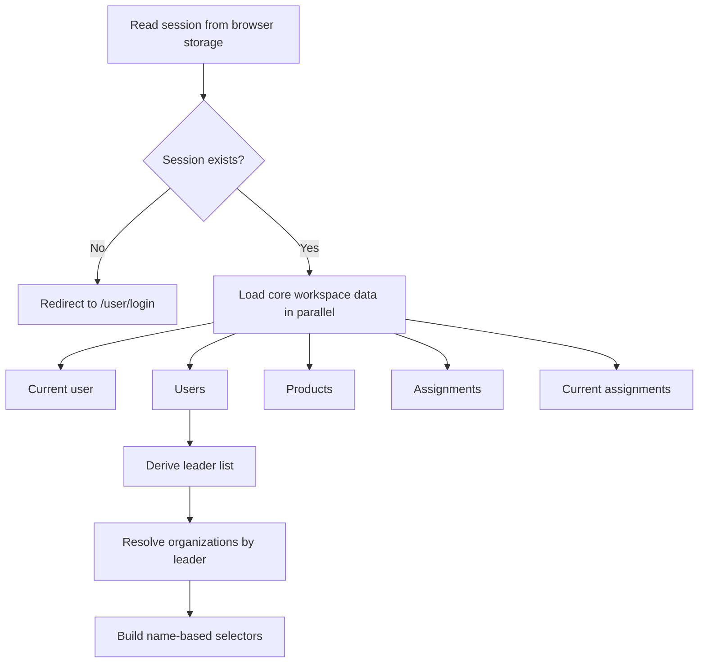

# AssetFlow Frontend Documentation

This document describes the frontend application in `client/asset-flow`.

The app is a Next.js 16 App Router project that provides:

- a marketing-style home page
- authentication flows for register, login, and Google OAuth
- a session-aware workspace for users, organizations, products, assignments, protocols, and AI tools

## 1. Tech Stack

| Area | Implementation |
| --- | --- |
| Framework | Next.js `16.1.6` |
| UI runtime | React `19.2.3` |
| Language | TypeScript |
| Styling | Tailwind CSS v4 + utility classes |
| State management | Local React state and custom hooks |
| Networking | Native `fetch` through a shared `apiRequest()` wrapper |
| Auth persistence | `sessionStorage` with migration cleanup from legacy `localStorage` |
| Linting | ESLint |

## 2. Frontend Goals

The current frontend is intentionally client-heavy and optimized for speed of delivery:

- keep all user-facing flows inside the Next.js app
- centralize API access through a single wrapper
- store auth session only in the browser
- expose backend capabilities through human-friendly forms and selectors
- prefer names in the UI and only fall back to numeric references when the frontend cannot resolve related records

## 3. Quick Start

### Install

```bash
npm install
```

### Run in development

```bash
npm run dev
```

The frontend runs on `http://localhost:3000` by default.

### Environment variable

The API base URL comes from:

```bash
NEXT_PUBLIC_API_URL=http://localhost:8080
```

If the variable is not set, the frontend falls back to `http://localhost:8080`.

### Verification

```bash
npm run lint
npm run build
```

For explicit webpack verification in this monorepo, this also works:

```bash
./node_modules/.bin/next build --webpack
```

## 4. High-Level Directory Layout

```text
client/asset-flow/
├── app/
│   ├── components/
│   │   ├── Pages/User/
│   │   │   ├── AccountPage.tsx
│   │   │   └── account/
│   │   │       ├── shared.tsx
│   │   │       ├── types.ts
│   │   │       ├── useAccountWorkspace.ts
│   │   │       ├── utils.ts
│   │   │       └── sections/
│   │   ├── shared/Forms/Auth/
│   │   ├── shared/Navigation/
│   │   ├── shared/ui/
│   │   └── shared/utils/
│   ├── lib/
│   ├── oauth/callback/
│   ├── user/account/
│   ├── user/login/
│   ├── user/register/
│   ├── globals.css
│   ├── layout.tsx
│   └── page.tsx
├── public/
├── next.config.ts
├── tailwind.config.ts
└── package.json
```

## 5. Route Map

| Route | File | Purpose |
| --- | --- | --- |
| `/` | `app/page.tsx` | Home / landing page |
| `/user/login` | `app/user/login/page.tsx` | Login screen and Google sign-in entry point |
| `/user/register` | `app/user/register/page.tsx` | Registration screen and Google registration entry point |
| `/oauth/callback` | `app/oauth/callback/page.tsx` | OAuth code exchange and session creation |
| `/user/account` | `app/user/account/page.tsx` | Workspace wrapper page |

## 6. Application Shell

### `app/layout.tsx`

`RootLayout` applies the global stylesheet and renders the shared top navigation above every page:

- imports `app/globals.css`
- renders `Navigation`
- renders the route content below it

### `app/components/shared/Navigation/Navigation.tsx`

The navigation bar is client-side because it reads the browser session.

Responsibilities:

- load the current auth session from browser storage
- subscribe to auth changes
- show either:
  - `Home`, `Workspace`, current role badge, and `Logout`, or
  - `Home`, `Sign in`, and `Get started`
- clear session and redirect to `/user/login` on logout

## 7. Authentication Architecture

Authentication is fully browser-driven.

### 7.1 Register flow

Files:

- `app/user/register/page.tsx`
- `app/components/shared/Forms/Auth/RegisterForm.tsx`

Behavior:

- collects `fullName`, `email`, `password`, `role`, and optional `age`
- only offers `EMPLOYEE` and `LEADER` in the UI
- for employees, attempts to pre-load companies by:
  - fetching `/auth/users` without auth
  - filtering leaders
  - resolving each leader with `/org/leader/:leaderId`
- falls back to a numeric company input if organization discovery fails
- submits registration to `/auth/register`
- redirects to `/user/login` after success
- Google registration starts the same OAuth flow as Google login via `/auth/oauth2/login`

### 7.2 Login flow

Files:

- `app/user/login/page.tsx`
- `app/components/shared/Forms/Auth/LoginForm.tsx`

Behavior:

- collects `name`, `email`, and `password`
- submits to `/auth/login`
- saves the returned auth payload through `saveAuthSession()`
- redirects to `/user/account`
- Google sign-in redirects the browser to `/auth/oauth2/login`

### 7.3 OAuth callback flow

File:

- `app/oauth/callback/page.tsx`

Behavior:

- reads the OAuth `code` query parameter
- sends it to `/auth/oauth/exchange`
- saves the returned auth payload to browser session storage
- redirects to `/user/account`
- shows error states when the code is missing or exchange fails

### 7.4 Session lifecycle

File:

- `app/lib/session.ts`

Key rules:

- session is stored under the key `auth`
- primary storage is `sessionStorage`
- legacy `localStorage` values are migrated or removed
- malformed sessions are deleted
- expired sessions are deleted
- session changes dispatch a custom browser event: `assetflow:auth-change`
- the UI can subscribe to both native storage events and the custom event

Security-related behavior:

- session survives page refresh inside the current tab
- session does not intentionally persist across browser restarts
- invalid and expired records are actively cleaned up

### 7.5 API-triggered session invalidation

File:

- `app/lib/api.ts`

If an authenticated request receives `401` or `403`, the frontend automatically clears the current session before surfacing the error.

## 8. Shared API Layer

### `app/lib/api.ts`

This is the only network helper the app currently uses.

Main exports:

- `getApiBaseUrl()`
- `buildApiUrl(path, searchParams?)`
- `apiRequest<T>(path, options?)`
- `getErrorMessage(error)`
- `ApiError`

`apiRequest()` responsibilities:

- build the absolute URL using `NEXT_PUBLIC_API_URL`
- attach `Accept` and `Content-Type` headers as needed
- attach `Authorization: Bearer <token>` when `auth !== false`
- support JSON and raw body requests
- disable request caching with `cache: "no-store"`
- normalize JSON and text error responses

Note:

- `axios` is installed in `package.json`, but the current codebase uses `fetch` through `apiRequest()` instead

## 9. Shared Type Layer

File:

- `app/lib/types.ts`

Important DTOs:

- `AuthSession`
- `UserDto`
- `OrganizationDto`
- `ProductDto`
- `AssignmentDto`
- `ProtocolDto`
- `AiResponseDto`
- `LoginResponse`

Important nuance:

- the shared `Role` type still includes `"ADMIN"`
- the current UI intentionally exposes only `"LEADER"` and `"EMPLOYEE"`
- that mismatch exists because the frontend may still receive admin-like backend/session data even though the UI no longer offers admin creation paths

## 10. Workspace Architecture

The workspace is rendered at `/user/account`.

Main files:

- `app/user/account/page.tsx`
- `app/components/Pages/User/AccountPage.tsx`
- `app/components/Pages/User/account/useAccountWorkspace.ts`
- `app/components/Pages/User/account/shared.tsx`
- `app/components/Pages/User/account/utils.ts`
- `app/components/Pages/User/account/sections/*.tsx`

### 10.1 Current split

`AccountPage.tsx` is now a thin shell responsible for:

- session gate rendering
- hero and sidebar layout
- wiring workspace state into section components

`useAccountWorkspace.ts` is the main orchestration hook and owns:

- session sync and redirect behavior
- bootstrap loading
- per-section state
- pending and feedback registries
- derived selectors and label builders
- all workspace mutations and fetch actions

Section components:

- `ProfileSection.tsx`
- `UsersSection.tsx`
- `OrganizationsSection.tsx`
- `ProductsSection.tsx`
- `AssignmentsSection.tsx`
- `ProtocolsSection.tsx`
- `AiSection.tsx`

Shared local workspace primitives:

- `shared.tsx`
  - `SectionCard`
  - `FeedbackMessage`
  - `StatCard`
  - `EmptyState`
  - `FieldHint`
  - `SelectField`
- `utils.ts`
  - parsing helpers
  - date formatting helpers
  - role badge helper
  - reusable section metadata
- `types.ts`
  - local view-model types such as `KnownOrganization`, `SelectOption`, and `Feedback`

### 10.2 Workspace bootstrap flow

On load, the workspace behaves like this:



### 10.3 State strategy inside the workspace hook

The workspace does not use Redux, Zustand, or React Query.

Instead it uses:

- React local state for domain data
- `feedbackByKey` for success/error banners by feature area
- `pendingByKey` for loading states by feature area
- helper functions like `runAction()` to standardize:
  - pending state
  - feedback clearing
  - success messages
  - error normalization

### 10.4 Name-first UI strategy

The workspace tries to avoid forcing users to work directly with numeric references.

Examples:

- users are shown as `Full Name • Email`
- organizations are shown as `Organization Name • led by Leader Name`
- products are shown as `Brand Model • AssetTag`
- assignments combine teammate and asset names

Fallback behavior:

- if the frontend cannot build a selector list, forms fall back to numeric reference inputs
- the backend still receives numeric IDs where required

## 11. Workspace Feature Map

### Profile

Files:

- `sections/ProfileSection.tsx`
- `useAccountWorkspace.ts`

Capabilities:

- load current user
- edit profile
- update session role after profile changes
- refresh workspace
- sign out

### Users

Files:

- `sections/UsersSection.tsx`

Capabilities:

- load all users
- load one user
- delete a user
- inspect company and assignment counts

### Organizations

Files:

- `sections/OrganizationsSection.tsx`

Capabilities:

- find an organization by leader
- create an organization
- join a user to an organization
- promote a user to leader
- load organization inventory

### Products

Files:

- `sections/ProductsSection.tsx`

Capabilities:

- create a product
- create a product in compatibility mode
- update a product
- load all products
- load a product by reference
- search by asset tag
- search by type
- delete a product

### Assignments

Files:

- `sections/AssignmentsSection.tsx`

Capabilities:

- create assignment
- update assignment
- load assignment by reference
- load all assignments
- filter by teammate
- filter by asset
- load current assignments
- delete assignment

### Protocols

Files:

- `sections/ProtocolsSection.tsx`

Capabilities:

- create protocol
- load saved protocol
- open generated protocol file in a new tab

### AI

Files:

- `sections/AiSection.tsx`

Capabilities:

- submit prompt
- display generated response
- display created timestamp and total duration

Sensitive backend details such as raw endpoint labels, direct route descriptions, and AI thinking traces are intentionally not shown in the workspace UI.

## 12. Backend Endpoint Usage Map

The workspace no longer displays endpoint names to end users, but the implementation still depends on them.

### Auth

- `POST /auth/register`
  - used by `RegisterForm.tsx`
- `POST /auth/login`
  - used by `LoginForm.tsx`
- `GET /auth/user/:userId`
  - used by workspace bootstrap and profile refresh
- `PUT /auth/user/edit/:userId`
  - used by profile update
- `GET /auth/users`
  - used by workspace bootstrap, user management, and company discovery during registration
- `DELETE /auth/user/delete/:userId`
  - used by user deletion
- `GET /auth/oauth2/login`
  - browser redirect target for Google auth
- `POST /auth/oauth/exchange`
  - used by OAuth callback

### Organizations

- `GET /org/leader/:leaderId`
  - used to resolve organization summaries and company lookup
- `POST /org/create/:leaderId`
  - used to create an organization
- `POST /org/join/:userId/:organizationId`
  - used to join a user to a company
- `POST /org/becomeLeader/:userId/:organizationId`
  - used to promote a leader
- `GET /org/inventory/:organizationId`
  - used to fetch company inventory

### Products

- `GET /product/all`
- `POST /product`
- `POST /product/add`
- `GET /product/:productId`
- `PUT /product/:productId`
- `DELETE /product/:productId`
- `GET /product/asset/:assetTag`
- `GET /product/search/type/:type`

### Assignments

- `POST /assignment/add`
- `PUT /assignment/update/:assignmentId`
- `GET /assignment/get/:assignmentId`
- `GET /assignment/all`
- `GET /assignment/user/:userId`
- `GET /assignment/product/:productId`
- `GET /assignment/current`
- `DELETE /assignment/delete/:assignmentId`

### Protocols

- `GET /protocol/:protocolId`
- `POST /protocol/create/:organizationId/user/:userId`

### AI

- `POST /ai/generate?prompt=...`

## 13. Styling System

### Global styling

File:

- `app/globals.css`

The app uses Tailwind utilities and a small amount of global base styling:

- `color-scheme: light`
- system sans-serif font stack
- light neutral page background
- default heading and paragraph resets

### Tailwind theme

File:

- `tailwind.config.ts`

Custom theme extensions are minimal.

The main custom token is the `brand` color scale:

- `brand.50` through `brand.900`

These brand colors drive:

- primary buttons
- focus rings
- status chips
- accent surfaces

### UI primitives

Files:

- `app/components/shared/ui/Button.tsx`
- `app/components/shared/ui/Input.tsx`
- `app/components/shared/ui/Label.tsx`
- `app/components/shared/ui/Textarea.tsx`
- `app/components/shared/utils/cn.ts`

These primitives provide:

- consistent rounded input/button styling
- consistent focus states
- variant support for buttons
- error styling support for inputs and textareas

## 14. Security Notes

The frontend contains several deliberate safety choices:

- browser auth persistence uses `sessionStorage`
- invalid or expired sessions are auto-removed
- authenticated `401` and `403` responses clear the current session
- the workspace redirects to login when there is no active session
- raw backend route names are not shown in the workspace UI
- raw protocol file URLs are hidden from the UI, even though the user can still open the file
- AI metadata is reduced to a safe, user-friendly subset

## 15. Known Quirks and Maintenance Notes

These are useful to know before changing the code:

- `Role` still includes `ADMIN` in `app/lib/types.ts`, even though the current frontend only offers `LEADER` and `EMPLOYEE`
- `axios` is installed but not used by the current frontend
- `app/components/shared/Navigation/navigation.css` currently exists but is empty and unused
- company selection on the register page depends on backend endpoints being reachable without auth
- the workspace eagerly loads several datasets on mount; it is simple but not optimized for large datasets
- the workspace hook is much smaller than the old 3000-line page, but it still centralizes a large amount of business logic in one hook

## 16. How To Extend the Frontend

### Add a new top-level page

1. Create a new route file in `app/.../page.tsx`.
2. Compose the page from shared UI primitives or feature-specific components.
3. Add navigation links if the page should be directly reachable.

### Add a new backend call

1. Prefer `apiRequest()` from `app/lib/api.ts`.
2. Add or reuse a DTO in `app/lib/types.ts`.
3. If the call is workspace-related, place the action in `useAccountWorkspace.ts`.
4. Surface loading and feedback through `pendingByKey` and `feedbackByKey`.

### Add a new workspace section

1. Add a section file in `app/components/Pages/User/account/sections/`.
2. Accept `workspace: AccountWorkspaceState` as the prop.
3. Keep rendering logic inside the section component.
4. Put new fetch/mutation logic in `useAccountWorkspace.ts`.
5. Add the section entry to `workspaceSections` in `utils.ts`.
6. Render the new section in `AccountPage.tsx`.

### Add a new form control

Prefer existing primitives:

- `Button`
- `Input`
- `Label`
- `Textarea`
- `SelectField` from the account shared module when the control belongs to the workspace

## 17. Suggested Improvement Areas

If the codebase grows further, these are the next likely improvement points:

- split `useAccountWorkspace.ts` into domain hooks such as:
  - `useWorkspaceAuth`
  - `useWorkspaceUsers`
  - `useWorkspaceOrganizations`
  - `useWorkspaceProducts`
  - `useWorkspaceAssignments`
- introduce request caching or query management for read-heavy screens
- add automated tests for auth/session behavior and workspace mutations
- move endpoint strings into a dedicated typed endpoint map if backend routes continue to grow
- align frontend role types with backend policy once admin support is fully removed or formally retained

## 18. Verification Checklist

Before shipping frontend changes, verify:

- `npm run lint`
- `npm run build`
- login flow still stores session correctly
- logout clears session and redirects correctly
- OAuth callback still exchanges code and redirects correctly
- `/user/account` still redirects when unauthenticated
- workspace forms still load selectors and submit successfully

---

If you need deeper docs for one area next, the best follow-up documents would be:

- a backend/frontend endpoint contract
- a workspace state diagram
- a contributor guide for adding new workspace sections
